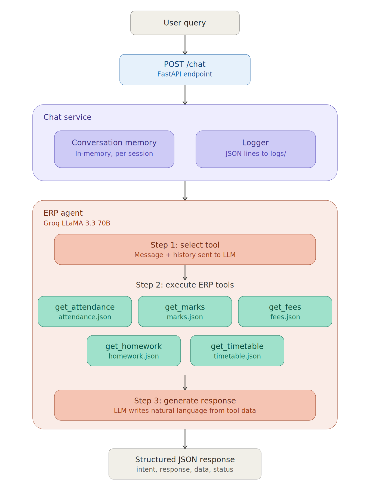

# 🎓 School ERP AI Assistant

An AI-powered School ERP Assistant that understands natural language queries, plans tool execution, fetches data from ERP modules, and responds intelligently using **FastAPI + Groq (LLaMA 3.3 70B)**.

## 🏗️ Architecture


## 📁 Project Structure

```
school-ai-assistant/
├── app/
│   ├── api/
│   │   └── routes.py          # FastAPI endpoints
│   ├── agents/
│   │   └── erp_agent.py       # AI agent with tool calling
│   ├── services/
│   │   └── chat_service.py    # Orchestration layer
│   ├── tools/
│   │   └── erp_tools.py       # 5 ERP tools + definitions
│   ├── memory/
│   │   └── conversation.py    # In-memory conversation store
│   ├── models/
│   │   └── schemas.py         # Pydantic models
│   ├── utils/
│   │   └── logger.py          # Structured JSON logger
│   └── main.py                # FastAPI app entry point
├── mock_data/
│   ├── attendance.json
│   ├── marks.json
│   ├── fees.json
│   ├── homework.json
│   └── timetable.json
├── logs/
│   └── erp_assistant.log      # Auto-generated interaction logs
├── .env.example
├── requirements.txt
└── README.md
```

## 🚀 Setup & Run

### 1. Clone the repository
```bash
git clone https://github.com/DevAnas19/school-ai-assistant
cd school-ai-assistant
```

### 2. Create virtual environment
```bash
python -m venv venv
source venv/bin/activate      # Linux/Mac
venv\Scripts\activate         # Windows
```

### 3. Install dependencies
```bash
pip install -r requirements.txt
```

### 4. Configure environment variables
```bash
cp .env.example .env
# Edit .env and add your GROQ_API_KEY
# Get a free key at: https://console.groq.com
```

### 5. Run the server
```bash
uvicorn app.main:app --reload --port 8000
```

### 6. Open API docs
```
http://localhost:8000/docs
```

## 📡 API Endpoints

### `POST /chat`
Send a natural language query to the ERP assistant.

**Request:**
```json
{
  "message": "Show my attendance for this month",
  "student_id": "STU001",
  "session_id": "my-session-123"
}
```

**Response:**
```json
{
  "intent": "Attendance",
  "response": "Your attendance for June is 91.7% — you were present 11 out of 12 days.",
  "data": { ... },
  "execution_plan": {
    "intent": "Attendance",
    "tools_selected": ["get_attendance"],
    "reasoning": "...",
    "steps": [ "..." ]
  },
  "status": "success",
  "session_id": "my-session-123",
  "timestamp": "2026-06-29T..."
}
```

### `GET /chat/history`
```
GET /chat/history?session_id=my-session-123&student_id=STU001
```

### `GET /logs`
```
GET /logs?limit=20
```

## 💬 Example Queries

### Single-tool queries
- `Show my attendance`
- `What is my attendance percentage?`
- `What are my Mathematics marks?`
- `Which subject has the highest score?`
- `Have I paid this month's fees?`
- `Show pending fees`
- `What homework is pending?`
- `Show assignments due tomorrow`
- `What's my timetable for tomorrow?`
- `When is my Science class?`

### Multi-step queries (Bonus)
- `Show my attendance, marks, and pending fees`
- `What homework do I have and what's today's timetable?`

### Context-aware (Conversation Memory)
```
User: Show my marks
Bot: [displays all subject marks]
User: Which one has the highest score?
Bot: [understands context — answers about marks without re-asking]
```

### Bonus features implemented
- ✅ Multi-Step Task Execution
- ✅ Academic Performance Summary (`Summarize my academic performance`)
- ✅ Smart Recommendations (`How can I improve my grades?`)
- ✅ Natural Language Search (`Which subjects am I weak in?`)
- ✅ Attendance Insights (`Can I maintain 90% attendance?`)

## 🤖 AI Model
- **Provider:** Groq
- **Model:** LLaMA 3.3 70B Versatile
- **Technique:** Function Calling (Tool Use)

## 🔑 Mock Student Data
- **Student ID:** STU001
- **Name:** Anas Khan
- **Class:** 10-A
- **Academic Year:** 2025-26
